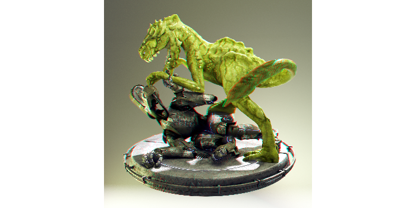

 #  Stereo to Anaglyph 

Convert side-by-side stereo images to red–cyan anaglyphs.

This extension is based on [Stereoscopic 3D Viewer](https://chrome.google.com/webstore/detail/stereoscopic-3d-viewer/gjihpcejlpnmjimgafnfmfkbglajmdlg). The "Dubois" method uses the method described [here](http://stereo.jpn.org/eng/stphmkr/help/stereo_13.htm) and the "Half-Color Optimized" method uses the "Optimized Anaglyphs" described [here](https://3dtv.at/Knowhow/AnaglyphComparison_en.aspx).

- Open the stereo image in a new tab. This is to avoid the "canvas has been tainted by cross-origin data" error.

- In the context menu, select `Stereo to Anaglyph` > `Red–Cyan Dubois`. If the images are swapped, select `Cyan–Red Dubois` instead.

- To revert to the original image, select  `Stereo to Anaglyph` > `Original`.
 
## Demonstration

Side-by-side ([Creature Factory 2 by Andy Goralczyk](https://docs.blender.org/manual/en/latest/render/output/properties/stereoscopy/usage.html)): 

Red–Cyan Dubois Anaglyph: 

## Installation

- Download the file `Stereo_to_Anaglyph.zip` and unzip.
- Navigate to ``chrome://extensions``.
- Activate ``Developer mode``.
- Click on ``Load unpacked``.
- Select the unzipped directory.
- Enable the extension.
